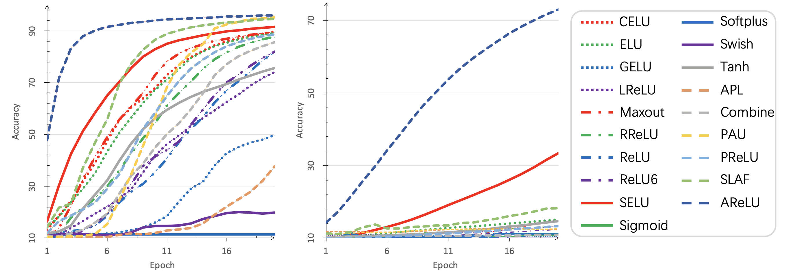

# AReLU: Attention-based-Rectified-Linear-Unit

Activation Function Player with PyTorch for supervised learning and transfer learning.


## Content

* [Introduction](#1)
* [Install](#2)
* [Run](#3)
* [Explore](#4)

##  <h2 id="1">1. Introduction</h2>

This repository is the implementation of paper [AReLU: Attention-based-Rectified-Linear-Unit](https://arxiv.org/pdf/2006.13858.pdf).

**This project is friendly to newcomers of PyTorch.**

With this repository, you can design and compare different activation functions on **transfer learning**.

## <h2 id="2">2. Install</h2>

```shell
conda create -n AFP python=3.7 -y
conda activate AFP
pip install -r requirements.txt
```

**NOTE**: PAU is only CUDA supported. You have to compile it first:

```shell
pip install airspeed==0.5.14 

cd activations/pau/cuda
python setup.py install
```

The code of PAU is directly token from [PAU](https://github.com/ml-research/pau.git), if you occur any problems while compiling, please refer to the original repository.

If you just want to have a quick start, and do not want to compile with PAU, just comment out the following lines in [activations/\_\_init\_\_.py](activations/__init__.py):

```python
try:
    from .pau.utils import PAU
    __class_dict__["PAU"] = PAU
except Exception:
    raise NotImplementedError("")
```

## <h2 id="3">3. Run</h2>

```shell
python -m visdom.server & # start visdom
python main.py # run with default parameters
```

Click [here](https://localhost:8097/) to check your training process.

**NOTE**: The program will download and save dataset under args.data_root automatically.

**Run with specified parameters**

```shell
    python main.py -h
        usage: main.py [-h] [--batch_size BATCH_SIZE] [--lr LR] [--lr_aux LR_AUX]
                    [--epochs EPOCHS] [--epochs_aux EPOCHS_AUX] [--times TIMES]
                    [--data_root DATA_ROOT]
                    [--dataset {MNIST,SVHN,EMNIST,KMNIST,QMNIST,FashionMNIST}]
                    [--dataset_aux {MNIST,SVHN,EMNIST,KMNIST,QMNIST,FashionMNIST}]
                    [--num_workers NUM_WORKERS]
                    [--net {BaseModel,ConvMNIST,LinearMNIST}] [--resume RESUME]
                    [--af {APL,AReLU,GELU,Maxout,Mixture,SLAF,Swish,ReLU,ReLU6,Sigmoid,LeakyReLU,ELU,PReLU,SELU,Tanh,RReLU,CELU,Softplus,PAU,all}]
                    [--optim {SGD,Adam}] [--cpu] [--exname {AFS,TransferLearning}]
                    [--silent]

        Activation Function Player with PyTorch.

        optional arguments:
        -h, --help            show this help message and exit
        --batch_size BATCH_SIZE
                                batch size for training
        --lr LR               learning rate
        --lr_aux LR_AUX       learning rate of finetune. only used while transfer
                                learning.
        --epochs EPOCHS       training epochs
        --epochs_aux EPOCHS_AUX
                                training epochs. only used while transfer learning.
        --times TIMES         repeat runing times
        --data_root DATA_ROOT
                                the path to dataset
        --dataset {MNIST,SVHN,EMNIST,KMNIST,QMNIST,FashionMNIST}
                                the dataset to play with.
        --dataset_aux {MNIST,SVHN,EMNIST,KMNIST,QMNIST,FashionMNIST}
                                the dataset to play with. only used while transfer
                                learning.
        --num_workers NUM_WORKERS
                                number of workers to load data
        --net {BaseModel,ConvMNIST,LinearMNIST}
                                network architecture for experiments. you can add new
                                models in ./models.
        --resume RESUME       pretrained path to resume
        --af {APL,AReLU,GELU,Maxout,Mixture,SLAF,Swish,ReLU,ReLU6,Sigmoid,LeakyReLU,ELU,PReLU,SELU,Tanh,RReLU,CELU,Softplus,PAU,all}
                                the activation function used in experiments. you can
                                specify an activation function by name, or try with
                                all activation functions by `all`
        --optim {SGD,Adam}    optimizer used in training.
        --cpu                 with cuda training. this would be much faster.
        --exname {AFS,TransferLearning}
                                experiment name of visdom.
        --silent              if True, shut down the visdom visualizer.
```

**Full Experiment**

```shell
./train.sh
```
**NOTE**: This step is time consuming.



## <h2 id="4">4. Explore</h2>

**New activation functions**

1. Write a python script file under `activations`, such as *new_activation_functions.py*, where contains the implementation of new activation function.

2. Import new activation functions in [activations/\_\_init\_\_.py](activations/__init__.py).

**New network structure**

1. Write a python script file under `models`, such as *new_network_structure.py*, where contains the definition of new network structure. New defined network structure should be a subclass of **BaseModel**, which defined in `models/models.py`.

2. Import new network structure in [models/\_\_init\_\_.py](models/__init__.py).

**NOTE**: New activation functions and network sctructures will be automatically added into argparse. So, it is not necessary to modify `main.py`.

## Citation
If you use this code, please cite the following paper:
```
@misc{AReLU,
Author = {Dengsheng Chen and Kai Xu},
Title = {AReLU: Attention-based Rectified Linear Unit},
Year = {2020},
Eprint = {arXiv:2006.13858},
}
```